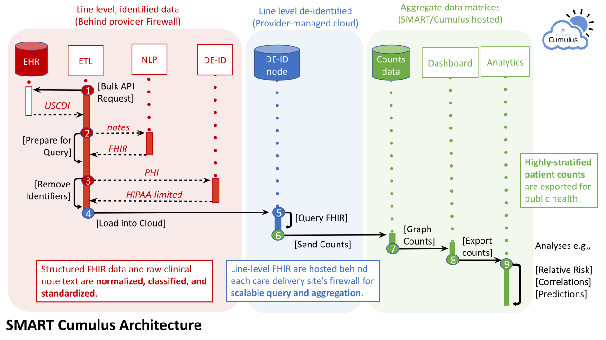

# Cumulus

**Clinical investigation at population scale.**

Cumulus builds from existing standards and open health IT tools to offer turnkey functions to
annotate FHIR data for analytics, de-identify data, and query for cohorts,
enabling rapid learning within a healthcare system.

Using Cumulus, you can:

* Place a "listener" within the provider’s firewall, that connects to the
  [SMART/HL7 Bulk Data API](https://hl7.org/fhir/uv/bulkdata/)
* Perform key functions, including de-identification and natural language processing of notes
* Extract data and populate an analytic FHIR environment

## "It's a Dashboard"

Ultimately, the bit of Cumulus that you interact with is a dashboard
for population health studies.

This dashboard lets you monitor symptoms or other health indicators over time,
in the population you are studying.

But Cumulus is not _just_ a dashboard.
It's an entire process that shepherds patient data from hospitals into that dashboard,
all while preserving privacy.

{: .note }
The Cumulus Dashboard is still a work in progress and is not public yet.
But you can still prepare & explore your data in the cloud today.

## OK, but in Concrete Terms, What Does It Do?

Cumulus provides four main features:

1. Natural language processing of clinical notes (to extract symptoms, etc.)
2. De-identification of patient data
3. Aggregation of multiple hospitals' data into one anonymized data stream of patient counts
4. A dashboard for monitoring health in that aggregate population

## The Cumulus Pipeline

Cumulus is a data pipeline,
from hospital servers all the way to pretty graphs in your web browser.

There are three main conceptual phases to Cumulus, each holding less and less protected health
information (PHI):

1. Hospital-side data extraction (full PHI)
1. Cloud-side data queries (anonymized, limited data set)
1. Dashboard monitoring (just counts of patients)

### Hospital-side Data Extraction

Each hospital installs [**Cumulus ETL**](etl) on their own servers and runs it at regular intervals
to extract data from their EHR systems, de-identify it, and load it into the cloud.

{: .note }
This phase starts with full PHI data sitting on hospital servers and
ends with an anonymized, limited data set sitting on the cloud, ready to be processed.

### Cloud-side Data Queries

Now that all that patient data has been de-identified and is sitting nicely in the hospital's cloud,
it is ready to be inspected and queried by the [**Cumulus Library**](library) using plain SQL.

There are many queries one could perform on all this data, it just depends on what studies are
being run and what symptoms are being monitored.
But each study's queries have the same basic idea: they only provide counts of affected people.

That is worth emphasizing: **the end result is simply a number**.
No PHI to worry about.

### Combining Data from Multiple Hospitals

With the data de-identified, it's now sharable with other hospital data to get a larger population
as a source for a clinical studies. The [**Cumulus Aggregator**](aggregator) can be deployed in the cloud
to automate combining data on whenever a hospital has a new dataset available.

The combined data can be downloaded directly from the aggregator for use in the dashboard. There
is also an API available that can be used to programmatically retrieve data.

{: .note }
In the future, you'll be able to view library/aggregator count data in the Cumulus Dashboard.
But until that's released, you can still explore your data using SQL directly.

## Further Reading

If you are simply familiarizing yourself with the project, click around on the sidebar and explore.

If you are looking to get your hands dirty and start using Cumulus, begin with the [ETL](etl).

Or if you just want to look at source code,
head to the [main project repo](https://github.com/smart-on-fhir/cumulus).
